# Original Enterprise AI 🚀

**A Modular, Scalable Decision Intelligence Platform for Modern Enterprises**

> **Transform decision-making with AI-driven foresight across all organizational levels**

---

## 📖 Overview

**Original Enterprise AI** is a strategic intelligence layer that connects to your existing enterprise systems (ERP, CRM, MES, IoT) and external data sources to deliver real-time, explainable recommendations. It bridges the gap between operational execution and strategic planning through advanced AI, machine learning, and edge-cloud architecture.

### 🎯 Key Capabilities

- **🤖 Conversational AI Interface** - Query systems in plain English
- **🔮 Scenario Simulation Engine** - Test strategic decisions before implementation
- **📊 Unified Intelligence Dashboard** - Single view across all enterprise data
- **⚡ Real-time Optimization** - Predictive analytics and adaptive strategies
- **🔍 Explainable AI** - Transparent decision rationale

---

## 🏗️ Architecture

### Three-Tier Modular Design

  LOCAL Nodes ◄──► Enterprise Manager ◄──► Group Manager (Multi-Entity)

  

  

### Core Components

| Component | Purpose | Deployment |
|-----------|---------|------------|
| **LOCAL Nodes** | Edge AI units at operational sites | On-premise/Edge |
| **Enterprise Manager** | Central AI engine for single entity | Cloud/Hybrid |
| **Group Manager** | Strategic layer for multi-entity orgs | Cloud |

## 📊 Technical Documentation
- [Full Architecture Deep Dive](architecture.md)
- [Innovation Statement](innovation.md) 

## 🚀 Use Cases

See how Original Enterprise AI solves real business problems across industries:
- **Logistics:** Predictive inventory & vendor management
- **Healthcare:** Hospital resource optimization  
- **Retail:** Dynamic pricing & demand forecasting

📖 **[Explore all use cases →](usecases.md)**
